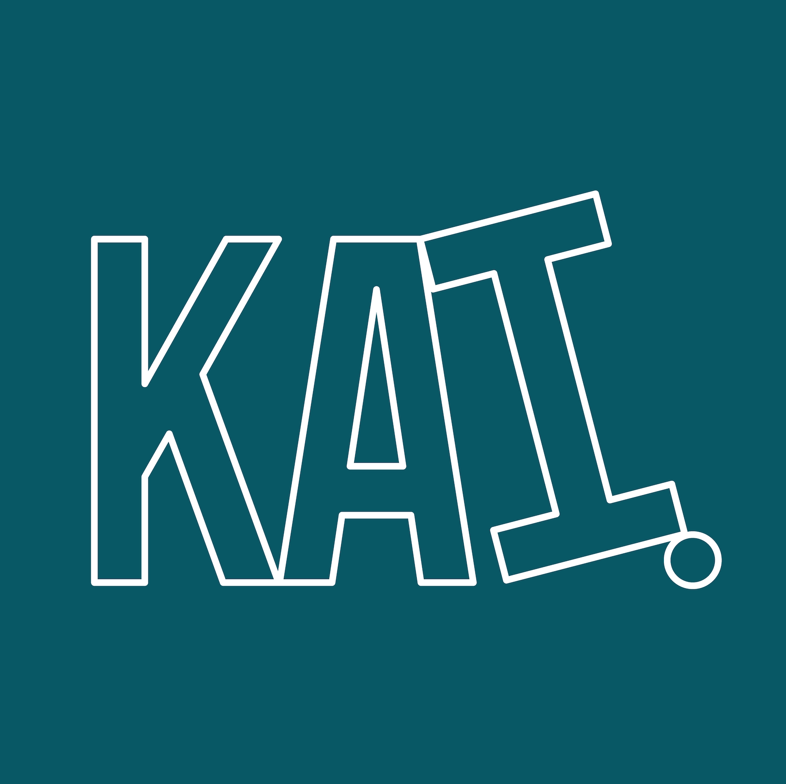
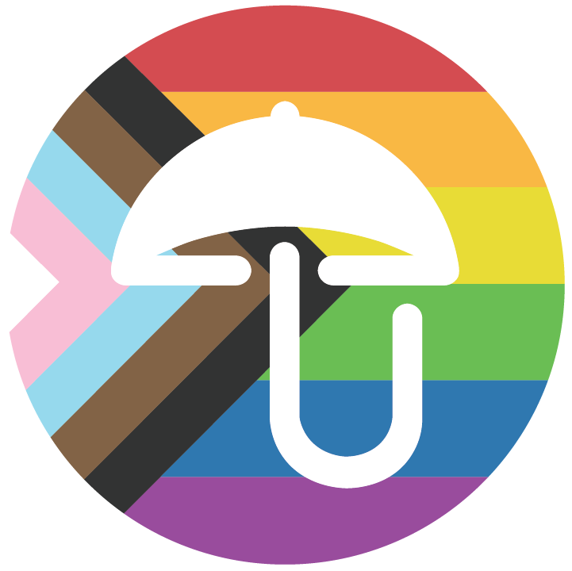

# CSSPortfolio1
## Portfolio
## Description
This is my Web Development portfolio.

## The Queer Umbrella
Description: The Queer Umbrella is a social organization that aims to connect the LGBTQ+ community. This website uses several CSS and JS specifications. 

## Kai Consulting
Description: Kai Consulting is my squarespace website with no customization, but acts as a placeholder for my project since I don't currently have additional portolio projects to show. 

## Project 1: Puppy Love
Description:
AS A dog guardian,
    I WANT to find compatible dog breeds for dates and date locations for my dog
    SO THAT I can combat loneliness and lack of connection brought on by COVID and allow myself
    and my dog to have enriched lives

## Table of Contents
[Usage](#Usage)

Licensing

Contributors

Installation

## Usage
Used bootstrap to create webpage.

