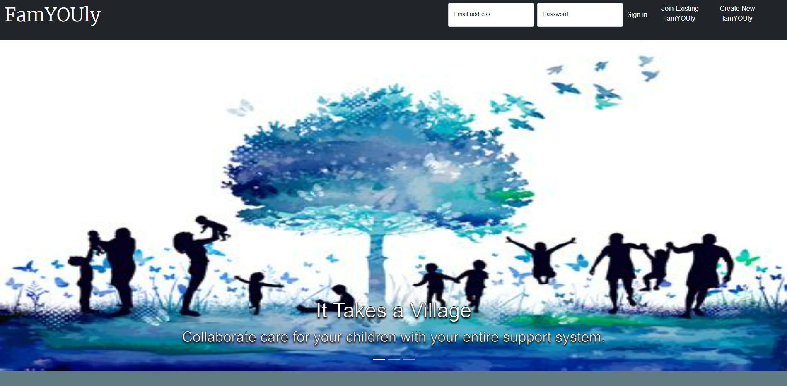
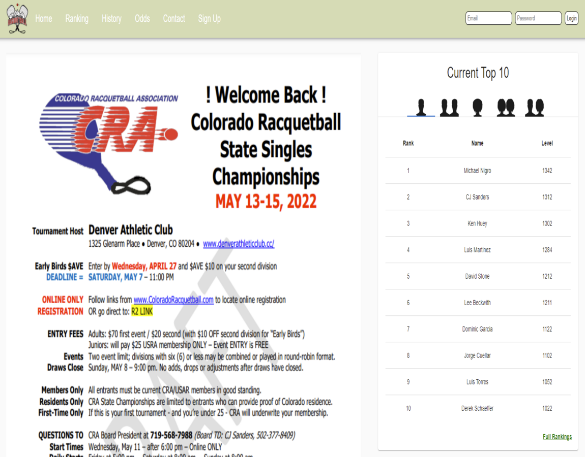

# CSSPortfolio1
## Portfolio
## Description
This is my Web Development portfolio.

## The Queer Umbrella
Description: The Queer Umbrella is a social organization that aims to connect the LGBTQ+ community. This website uses several CSS and JS specifications. 

## Kai Consulting
Description: Kai Consulting is my squarespace website with no customization, but acts as a placeholder for my project since I don't currently have additional portolio projects to show. 

## Project 1: Puppy Love
Description:
AS A dog guardian,
    I WANT to find compatible dog breeds for dates and date locations for my dog
    SO THAT I can combat loneliness and lack of connection brought on by COVID and allow myself
    and my dog to have enriched lives

## Project 2: FamYOUly
Description:
In today’s day and age, families are so much more than a mom, dad, and 2.5 kids. Sometimes grandparents take on a larger role, or parents split up and children have bonus parents. We created FamYOUly as a way to tackle the arduous task that is parenting in this modern day and age. With FamYOUly you can collaborate with your child’s support network to post events, have a shared calendar, add todos. No more forgetting to buy a poster board for your kid’s science project and being reminded the night before. You now have a place to list medications, allergies, and other medication, so your babysitter is on the same page and doesn’t whip out the peanut butter and send little Johnny to the hospital on your girls’ night. Store important contacts so you remember teacher’s names, etc. Welcome to FamYOUly, it takes a village, and we are here to help.

User Story: 
    AS A parent,
        I WANT an app that helps me co-parent
        SO THAT I can easily navigate, support, and communicate my child’s life with my family (/support network)

## Project 3: Colorado Racquetball Association Ranking Generator
Description:
AS A player
    I WANT to have an accurate ranking system and hub for tournament matches 
    SO THAT I can have an accurate standing in the racquetball community and be correctly seeded in future tournaments as well as know about future events in the community.

## Table of Contents
[Usage](#Usage)

Licensing
MIT

Installation

## Usage
Used bootstrap to create webpage.

